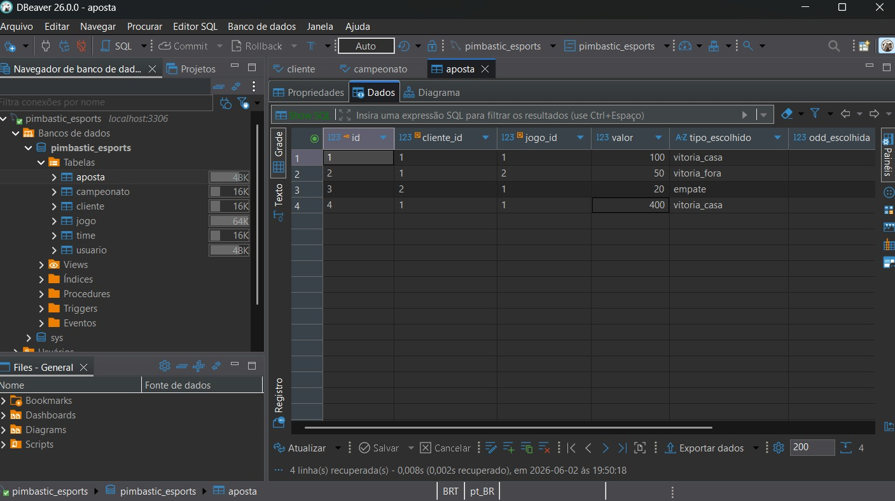
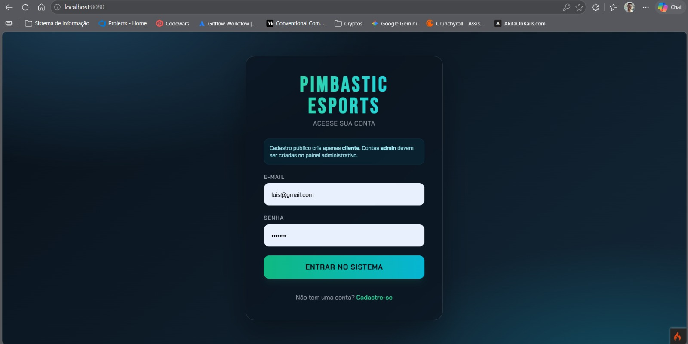
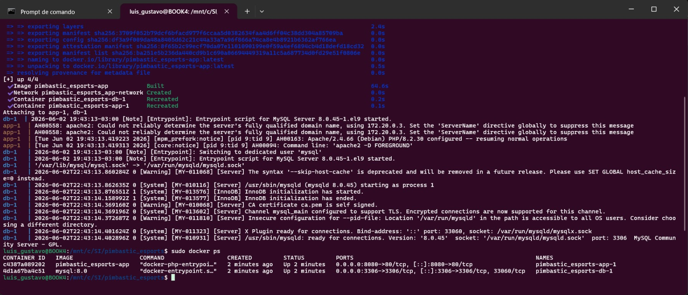
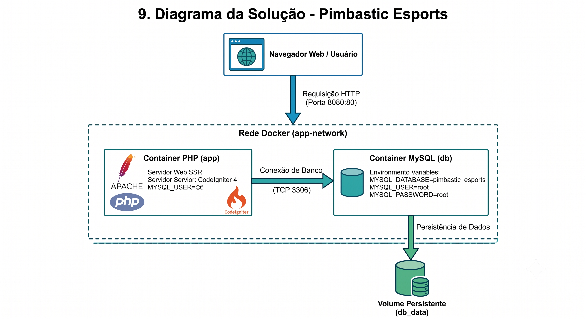

<<<<<<< Updated upstream
# Pimbastic Esports

Sistema Web para cadastro de campeonatos, times, jogos, clientes e apostas em eSports. O projeto foi migrado e atualizado para utilizar o framework **CodeIgniter 4**, com um front-end completo, moderno e responsivo.

---

## 🚀 Novidades desta Versão (Entrega 3)
- **Framework CodeIgniter 4**: Migração completa da arquitetura do projeto para a estrutura padrão MVC (Model-View-Controller) do CI4.
- **Roteamento Estrito**: Rotas configuradas no arquivo `app/Config/Routes.php` agrupando as funcionalidades de clientes (`/cliente`) e administração (`/admin`).
- **Aparência Premium (eSports Theme)**: Layout escuro de alta fidelidade com fontes modernas (`Chakra Petch` para interface e `Bebas Neue` para títulos), efeitos neon (verde/ciano) e transparências estilo glassmorphism.
- **Interface Responsiva**: Todo o painel e formulários se adaptam para dispositivos móveis e desktops com navegação retrátil.
- **Consumo de Mocks**: Listagens, histórico e formulários dinâmicos consumindo dados pré-configurados nos controllers PHP (SSR).
- **Interatividade no Sportsbook**: Odds funcionais com seleção dinâmica via JavaScript no formulário de aposta e estimativa de retorno em tempo real.

---

## 📂 Estrutura do Projeto
- `app/Config/Routes.php`: Rotas centralizadas do framework.
- `app/Controllers/`: Controladores contendo regras de negócio e mocks de dados SSR (`AuthController`, `ClienteController`, `AdminController`, etc.).
- `app/Views/`:
  - `layouts/master.php`: Layout base com importações de fontes, Tailwind CSS e navegação do portal.
  - `auth/`: Telas de login e cadastro.
  - `cliente/`: Sportsbook e histórico de apostas.
  - `admin/`: Painel de controle e sub-telas de gerenciamento (campeonatos, times, usuários).
- `public/index.php`: Front Controller que inicializa o CodeIgniter 4.
- `backup_old_system/`: Cópia de segurança contendo os arquivos PHP avulsos da entrega anterior.

---

## 🛠️ Como Executar o Projeto

### Pré-requisitos
- Docker Desktop (ou Docker Engine + Docker Compose) instalado e rodando.
- Porta `8080` livre na máquina host para a aplicação.

### Passo a Passo

1. **Inicie os Containers do Docker (Limpando Volumes Antigos):**
   Para garantir que o banco de dados e os novos volumes temporários sejam mapeados do zero, no diretório raiz do projeto execute:
   ```bash
   docker compose down -v
   docker compose up --build
   ```

2. **Acesse no Navegador:**
   Abra o seu navegador de preferência e entre em:
   ```text
   http://localhost:8080
   ```

3. **Criar o primeiro admin para testes:**
   O cadastro público cria apenas clientes. Para criar um admin inicial, rode o seeder abaixo:
   ```bash
   php spark db:seed AdminSeeder
   ```
   Opcionalmente, defina estas variáveis no ambiente antes de executar o comando:
   - `ADMIN_EMAIL`
   - `ADMIN_PASSWORD`

   Se você não definir nada, o seeder usa `admin@pimbastic.local` e `admin123`.

---

## 🎮 Roteiro de Teste (Como Avaliar)

O sistema conta com um redirecionamento inteligente na tela de login para facilitar a navegação rápida entre os dois perfis da aplicação:

1. **Acesso do Administrador (Dashboard & Cadastros):**
   - Acesse `http://localhost:8080` (será redirecionado para a tela de login).
   - Digite qualquer e-mail que contenha a palavra **`admin`** (ex: `admin@pimbastic.local`) e qualquer senha.
   - Clique em **Entrar no Sistema**.
   - Você será levado ao **Painel Administrativo** exibindo métricas do sistema e status online.
   - Navegue pelo menu lateral para acessar as listagens de **Campeonatos**, **Times** e **Usuários**.
   - Em cada listagem, clique no botão de **Novo Cadastro** para abrir os formulários com validações de campos. Preencha e salve (o sistema simula o salvamento e retorna feedback visual de sucesso).

2. **Acesso do Cliente (Sportsbook & Apostas):**
   - No cabeçalho, clique em **Sair** para retornar ao Login.
   - Digite qualquer e-mail comum (ex: `cliente@pimbastic.com` ou `player@gmail.com`) e qualquer senha.
   - Clique em **Entrar no Sistema**.
   - Você será levado ao **Mercado de Apostas (Sportsbook)** do cliente.
   - O sportsbook exibe o saldo do usuário (R$ 1.500,50) e cards interativos com jogos de eSports.
      - **Adicionar saldo (teste):** O cliente pode creditar saldo manualmente pelo dashboard em "Adicionar Saldo" para testar apostas — esse fluxo é simulado e não processa pagamentos reais.
   - **Interatividade das Odds**: Clique em um dos botões de odd ("Casa", "Empate" ou "Fora") de um jogo. O botão correspondente ficará marcado com brilho ciano, e um painel de cálculo aparecerá mostrando o retorno estimado da aposta em tempo real ao digitar um valor.
   - Insira um valor no input e clique em **Apostar** para registrar a aposta (mensagem de sucesso de mock é exibida).
   - Abaixo dos jogos, visualize a tabela com o histórico de apostas realizadas.
=======
5. Como Executar
Pré-requisitos
Docker Desktop ou Docker Engine com o plugin Docker Compose instalado.

Porta do host 8080 e 3306 desocupadas.

Guia Passo a Passo
Clone do Repositório:

Bash
git clone <URL_DO_REPOSITORIO>
cd pimbastic_esports
Configuração de Variáveis de Ambiente:
Certifique-se de preencher o arquivo .env na raiz do projeto com as chaves de infraestrutura requisitadas:

Fragmento do código
MYSQL_ROOT_PASSWORD=root
MYSQL_DATABASE=pimbastic_esports
MYSQL_USER=root
MYSQL_PASSWORD=root
Inicialização Limpa dos Containers:
Para limpar qualquer cache ou estado anterior de volumes e subir a infraestrutura completa de forma automatizada:

Bash
docker compose down -v
docker compose up --build -d
Acesso ao Sistema:
A aplicação estará acessível imediatamente via navegador no endereço:

Plaintext
http://localhost:8080
Provisionamento do Usuário Administrador (Seeder):
Para gerar as credenciais do primeiro perfil administrativo do sistema, execute o comando interno do framework:

Bash
php spark db:seed AdminSeeder
Nota: Caso as variáveis de ambiente de teste não estejam setadas, as credenciais padrão criadas serão: admin@pimbastic.local / senha: admin123.

6. Roteiro de Testes e Validação Tecnológica
O roteiro de testes simula o comportamento SSR adaptativo baseado em políticas de login de usuário:

Cenário A: Validação do Painel do Administrador
Navegue até http://localhost:8080 (o filtro de autenticação redirecionará para a tela de login).

Insira um e-mail que contenha o termo admin (ex: admin@pimbastic.local) e preencha qualquer senha.

Clique em Entrar no Sistema.

Valide a renderização do Painel Administrativo: observe os indicadores de métricas e o menu dinâmico de gerenciamento lateral.

Acesse as abas Campeonatos, Times e Usuários.

Realize o teste de entrada de dados clicando em Novo Cadastro. Os formulários possuem interceptores de validação simulados que retornam banners visuais de sucesso.

Cenário B: Validação do Ecossistema do Cliente (Sportsbook)
Clique em Sair no canto superior direito para limpar a sessão.

Efetue o login utilizando um e-mail comum de cliente (ex: cliente@pimbastic.com).

Confirme o acesso à interface do Sportsbook (exibindo saldo base simulado de R$ 1.500,50).

Interatividade de Odds via JS: Escolha um confronto de eSports e selecione um dos mercados ("Casa", "Empate" ou "Fora"). O elemento ganhará foco neon (ciano).

Digite um valor de aposta no campo apropriado; o script JavaScript processará o cálculo em tempo real exibindo a projeção do retorno financeiro.

Submeta a operação clicando em Apostar para registrar a transação fictícia e verificar o histórico atualizado no rodapé.

7. Evidências Técnicas de Execução
Abaixo encontram-se os mapeamentos obrigatórios de telas exigidos como artefato de entrega:

I. Containers Docker ativos e saudáveis (docker compose ps)
II. Aplicação Web acessível via navegador em localhost
III. Banco de Dados MySQL criado e populado via script automático de inicialização
"""

with open("README.md", "w", encoding="utf-8") as f:
f.write(readme_content)

print("README.md successfully optimized and generated.")

O seu arquivo Markdown está pronto
[file-tag: code-generated-file-0-1780439086781771750]

O arquivo `README.md` foi reestruturado para eliminar redundâncias e garantir a precisão técnica arquitetural exigida pelo trabalho prático.

### Ajustes Arquiteturais e Estruturais Aplicados:
1. **Unificação de Tópicos:** Seções sobre tecnologias, execução e cenários de testes foram agrupadas logicamente, removendo repetições sobre Docker e comandos de inicialização.
2. **Funcionamento Interno (Under the Hood):** Adição de uma seção específica detalhando o fluxo de rede isolada via `bridge` (`app-network`), a injeção do volume persistente `db_data` e a automação do schema via `/docker-entrypoint-initdb.d/`, correspondendo à exigência de detalhamento técnico.
3. **Mapeamento de Estrutura:** O mapa de diretórios reflete agora o padrão MVC autêntico do CodeIgniter 4 integrado aos arquivos de infraestrutura (IaC).
4. **Padronização de Comandos:** O fluxo de build limpo (`docker compose down -v` seguido de `up --build -d`) foi estabelecido como comando oficial para evitar colisões com instâncias anteriores do container MySQL.

Anexe as imagens (capturas de tela do `docker compose ps`, do Front-End operando e de um `SELECT` demonstrando os dados no SGBD) e referencie-as na seção `7. Evidências Técnicas de Execução` do documento. Não esqueça de inserir também o `diagrama.png` na raiz do projeto.







>>>>>>> Stashed changes
